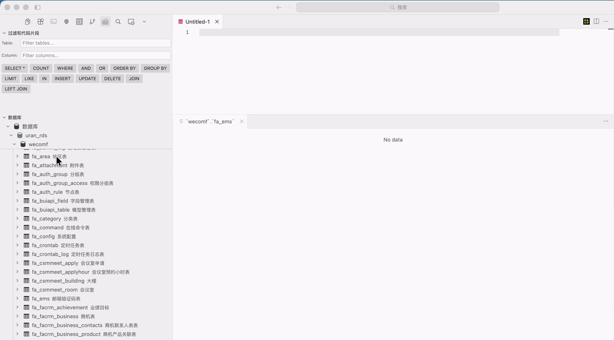
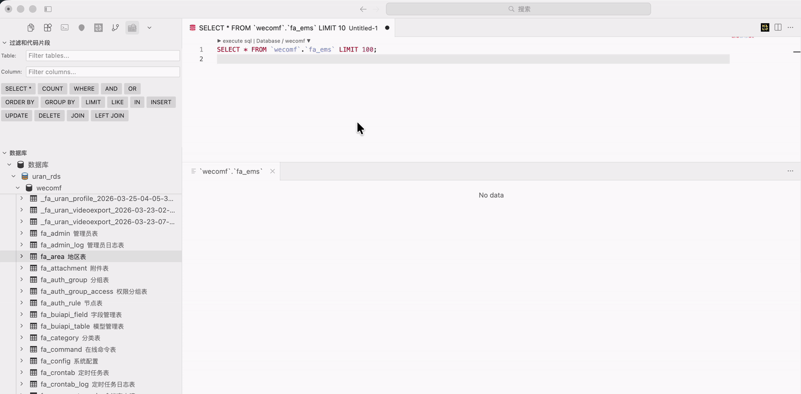

# Mysql Instant Query

[English](README.en.md)

Mysql Instant Query 是一款以 SQL 为核心的专业级数据库查询与开发工具，支持 MySQL、PostgreSQL、DuckDB、SQLite 等主流数据库，可从数据表快速生成 SQL、即时执行并可视化呈现查询结果，同时提供列名过滤、记录过滤、专业 ERD 实体关系图、自定义图形连接以及 Cursor 文件协议外部链接定位能力，帮助开发者高效完成数据库查询、分析与开发工作。

## 特色功能

### 1. sql查询
sql编辑器中,支持多连接,多sql语句查询



### 2. 过滤查询
支持列名过滤,记录过滤


### 3. ERD实体关系图
支持多表自定义连接,支持保存打开,以及导出图片功能


### 4. cursor协议
通过cursor://协议,在网页或外部工具中,直接调起cursor查询指定数据表




## 功能概览

### SQL 查询与结果分析
- **多连接查询** - 在 SQL 编辑器中按连接执行查询，适合同时管理多个数据库环境
- **多 SQL 语句执行** - 支持在同一编辑器内编写并执行多段 SQL，提升调试与数据验证效率
- **表驱动 SQL 生成** - 可从数据表、字段、结构信息快速生成常用查询语句，减少重复手写 SQL
- **查询结果可视化** - SQL 执行结果以结构化表格呈现，支持大结果集浏览、列宽调整和结果面板交互
- **智能 LIMIT 策略** - 可根据表数据规模配置自动 LIMIT，兼顾查询性能与结果完整性

### 快捷过滤能力
- **表过滤** - 根据表名或表注释快速定位目标数据表
- **列名过滤** - 在表结构和查询结果中快速筛选字段，适合宽表、复杂表结构和多字段结果集
- **记录过滤** - 在查询结果界面对记录进行快速过滤，便于定位异常数据、业务样本和关键记录
- **结构联动** - 字段过滤时自动展开相关表结构，降低在复杂数据库中查找字段的成本

### ERD 实体关系图
- **专业 ERD 视图** - 基于表结构、主键和外键信息生成实体关系图，辅助理解数据模型
- **多表自定义连接** - 支持在图中为多个数据表建立自定义关系连接，适配缺少外键约束的业务数据库
- **保存与打开** - 支持保存 ERD 图形布局并再次打开，沉淀项目级数据库结构视图
- **导出图片** - 支持将 ERD 导出为图片，便于技术文档、评审材料和团队协作使用
- **图形交互增强** - 提供缩放、缩略图、居中工具栏等交互能力，适合大型数据模型浏览

### Cursor 协议集成
- **外部链接定位表** - 支持通过 `cursor://` 文件协议从网页、文档或外部工具中调起 Cursor，并直接定位到指定数据表
- **开发流程串联** - 可将数据库表与内部系统、接口文档、研发平台或数据字典打通，减少上下文切换
- **快速查询入口** - 外部工具可直接跳转到目标数据库资源，形成面向开发者的高效查询入口

### 多数据库与连接管理
- **主流数据库支持** - 支持 MySQL、PostgreSQL、DuckDB、SQLite 等数据库
- **DuckDB 深度适配** - 支持 DuckDB 表结构、主键、外键和 ERD 元数据读取
- **连接测试** - 新增或编辑连接时可快速验证连接可用性，减少配置错误
- **连接编辑** - 支持编辑连接显示名称、连接参数、SSL 和数据库选项
- **安全存储** - 数据库密码通过 VS Code 安全存储能力保存

## 使用场景

- **日常数据查询** - 从表结构快速生成 SQL，执行后直接在结果界面分析数据
- **问题排查与调试** - 使用多 SQL 语句、记录过滤和列名过滤快速定位异常数据
- **数据库结构理解** - 通过表结构视图和 ERD 实体关系图梳理业务数据模型
- **团队知识沉淀** - 将 ERD 图片、Cursor 协议链接和数据表入口嵌入文档或内部平台
- **跨数据库开发** - 在 MySQL、PostgreSQL、DuckDB、SQLite 等环境中保持一致的查询体验

## 使用方法

### 添加数据库连接

1. 点击活动栏中的 **Mysql Instant Query** 图标
2. 点击侧边栏中的 **+** 按钮
3. 选择数据库类型并填写连接信息
4. 使用连接测试确认配置正确
5. 保存连接后浏览数据库、表和字段

### 执行 SQL 查询

打开 SQL 文件或从数据表生成 SQL，然后使用以下任一方式执行：

- 右键点击并选择 **Run MySQL Query**
- 使用快捷键：`Ctrl+Alt+E`（Windows/Linux）或 `Cmd+Alt+E`（macOS）
- 按 `F1` 并输入 `Run MySQL Query`

可以在同一编辑器中编写多条 SQL，并选择指定片段执行。

### 分析查询结果

- 使用列名过滤快速缩小字段范围
- 使用记录过滤快速定位目标数据
- 调整列宽以查看长文本、ID、时间和业务字段
- 根据表规模配置自动 LIMIT 策略，避免误查大表造成性能压力

### 使用 ERD

- 从数据库或多张数据表打开 ERD 实体关系图
- 使用主外键关系生成基础连接
- 为无外键约束的业务表添加自定义连接
- 保存图形布局并在后续继续编辑
- 将 ERD 导出为图片用于文档或评审

### 使用 Cursor 协议

在网页、文档或外部系统中配置 `cursor://` 链接后，可直接唤起 Cursor 并定位到指定数据表，用于数据字典、管理后台、接口文档和研发平台的快速跳转。

## 键盘快捷键

| 按键 | 命令 |
|-----|---------|
| `Ctrl+Alt+E` / `Cmd+Alt+E` | 运行 SQL 查询 |
| `Ctrl+Shift+T` / `Cmd+Shift+T` | 打开表 |
| `Ctrl+Shift+F` / `Cmd+Shift+F` | 聚焦表过滤输入框 |

## 设置

| 设置项 | 默认值 | 描述 |
|---------|---------|-------------|
| `mysql-instant-query.maxTableCount` | `500` | 树形视图中显示的最大表数量 |
| `mysql-instant-query.enableDelimiterOperator` | `true` | 启用 DELIMITER 操作符支持 |
| `mysql-instant-query.enableTelemetry` | `true` | 匿名使用情况收集 |
| `mysql-instant-query.enableCountQuery` | `false` | 在 SELECT 前运行 COUNT(*)，用于选择自动 LIMIT |
| `mysql-instant-query.defaultQueryLimit` | `100` | 小表的自动 LIMIT（启用行数查询时） |
| `mysql-instant-query.largeTableQueryLimit` | `5000` | 大表或未启用行数查询时的自动 LIMIT |
| `mysql-instant-query.largeTableThreshold` | `1000` | 用于判断大表 LIMIT 的行数阈值 |
| `mysql-instant-query.uriDefaultLimit` | `100` | 通过 URI 打开表时的默认 LIMIT |

## 环境要求

- Visual Studio Code 1.83.0 或更高版本
- Cursor 或兼容 VS Code 扩展生态的编辑器
- MySQL 5.0+、PostgreSQL、DuckDB 或 SQLite

## 发布

该扩展已发布到 Visual Studio Marketplace，标识为 [`meetrice.mysql-instant-query`](https://marketplace.visualstudio.com/items?itemName=meetrice.mysql-instant-query)。

### 快速发布

```bash
export VSCE_PAT="your_azure_devops_pat"   # Marketplace -> Manage scope
./publish.sh
```

该脚本会编译 TypeScript、打包 `.vsix`，并上传到 Marketplace。

### 仅本地安装（不发布到 Marketplace）

```bash
./build-and-install.sh
```

### 完整指南

请查看 **[docs/publishing.md](docs/publishing.md)**，其中包含：

- 创建 Publisher 和个人访问令牌（PAT）
- 预发布检查清单
- 手动逐步发布命令
- 故障排查（PAT 过期、版本重复等）

## 许可证

MIT

## Marketplace

可在 [Visual Studio Code Marketplace](https://marketplace.visualstudio.com/items?itemName=meetrice.mysql-instant-query) 获取，并可在 Cursor 中安装。

## 开源与交流

- 开源地址：[https://github.com/meetrice/vscode-mysql-instant-query](https://github.com/meetrice/vscode-mysql-instant-query)
- 微信交流：`meetrice`

欢迎通过 GitHub 提交 Issue、反馈使用建议或参与贡献；如需交流数据库查询、ERD 建模、Cursor 集成和插件使用经验，也可以添加微信 `meetrice`。

---

**Mysql Instant Query 致力于成为程序员高效数据库查询、数据分析与模型理解的利器。**
